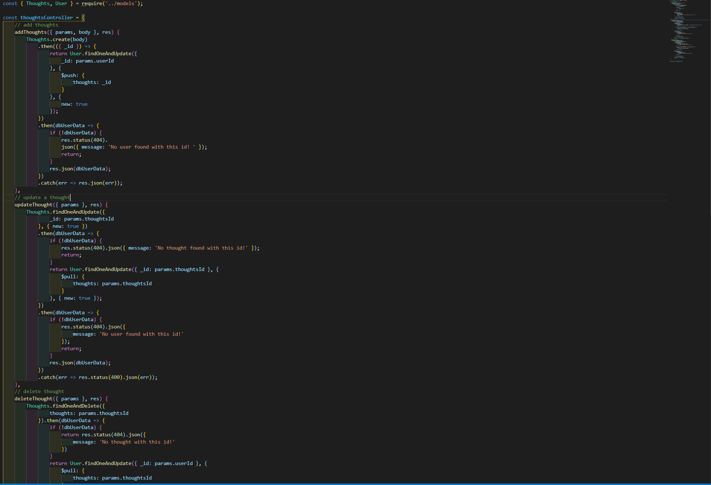

# social-media-NoSQL

## description:
Working with mongodb to develop the backend for a social media app. The app will be using the CRUD method to execute api requests using a NoSQL database.

## user story: 
AS A social media startup
I WANT an API for my social network that uses a NoSQL database
SO THAT my website can handle large amounts of unstructured data

## code snippets: 

## demo:

## Github repo:
https://github.com/merayoussef/social-media-NoSQL.git

